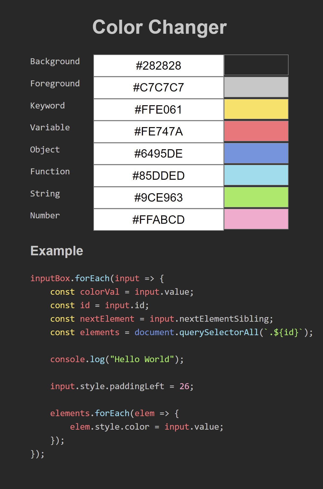

# My First Static Website
#### Coded by Tanay Patel
 

## What is this?

#### This was my first dive into making a webpage and web design. I used this as an opportunity to learn and apply some HTML, CSS and JavaScript. 

#### Being my first ever webpage, the project itself is super basic but it allowed me to use the fundementals I've learned and apply them to create something tanglable. The idea behind the page is you can input a HEX color codes in order to change elements of the page. 

#### Overall I am happy that I choose to create this as it sparked my dive into learning about web development and eventually  dominod into me codeing my [personal website](https://tanay-patel.com/)!
 

## Results
#### Below is an image of the webpage locally hosted.

